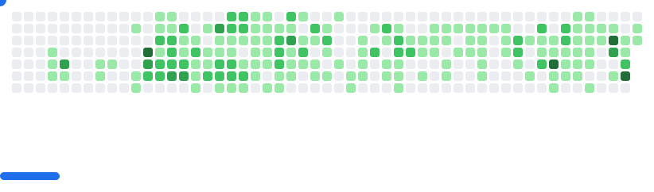

# GitHub Breakout

Generate a Breakout game SVG from a GitHub user's contributions graph.

This project grabs your contribution graph through the GitHub API and generates images for light and dark mode:

<picture>
  <source
    media="(prefers-color-scheme: dark)"
    srcset="example/dark.svg"
  />
  <source
    media="(prefers-color-scheme: light)"
    srcset="example/light.svg"
  />
  
</picture>

You can also customize colors:


You can also disable ghost bricks for days without activity, so all days count as a brick:

<picture>
  <source
    media="(prefers-color-scheme: dark)"
    srcset="example/dark-no-ghost.svg"
  />
  <source
    media="(prefers-color-scheme: light)"
    srcset="example/light-no-ghost.svg"
  />
  
</picture>

## Usage

### GitHub Action

You can use the provided GitHub Action to build the SVGs so you can display them on your profile (my profile for example: [github.com/cyprieng](https://github.com/cyprieng)).

The action generates dark, light and optionally custom SVGs, and has these inputs:

- github_username (required): GitHub username
- github_token: GitHub token used to fetch the contributions. Defaults to the action token if empty.
- enable_ghost_bricks: Enable ghost bricks for days without contribution
- output_path: Output path for SVGs (default is `./output/`)
- paddle_color: Paddle color for custom.svg
- ball_color: Ball color for custom.svg
- bricks_colors: Bricks colors as a list of colors separated by commas for custom.svg

This example GitHub workflow generates the SVGs every day and commits them to your repository:

```yaml
name: generate breakout svg

on:
  schedule:
    - cron: "0 */24 * * *"
  workflow_dispatch:

jobs:
  generate-svg:
    permissions:
      contents: write
    runs-on: ubuntu-latest
    timeout-minutes: 5

    steps:
      - name: Checkout repository
        uses: actions/checkout@v4

      - name: generate SVG
        uses: cyprieng/github-breakout@v1
        with:
          github_username: ${{ github.repository_owner }}

      - name: Move generated SVGs to temp
        run: |
          mkdir -p /tmp/breakout-images
          mv output/light.svg /tmp/breakout-images/breakout-light.svg
          mv output/dark.svg /tmp/breakout-images/breakout-dark.svg

      - name: Configure git
        run: |
          git config user.name "github-actions[bot]"
          git config user.email "github-actions[bot]@users.noreply.github.com"

      - name: Commit and force-push SVGs to target branch
        run: |
          git checkout --orphan github-breakout
          git rm -rf .
          mkdir images
          mv /tmp/breakout-images/* images/
          git add images
          git commit -m "chore: update GitHub breakout SVGs" || echo "No changes to commit"
          git push --force origin github-breakout
```

Then retrieve the image URLs from the github-breakout branch and add them to your README.md:

```html
<picture>
  <source
    media="(prefers-color-scheme: dark)"
    srcset="{YOUR IMAGE URL}/images/breakout-dark.svg"
  />
  <source
    media="(prefers-color-scheme: light)"
    srcset="{YOUR IMAGE URL}/images/breakout-light.svg"
  />
  
</picture>
```

### CLI

You need to get a GitHub Token, then you can run the following command:

`node dist/cli.js --username {username} --token {github token} --dark --light --ball-color "#006064" --paddle-color "#006064" --bricks-colors "#e0f7fa,#b2ebf2,#4dd0e1,#0097a7,#006064"`

Here is the list of available options:

- --username (required): GitHub username
- --token (required): Token with access to the user activity
- --dark: Generate dark version
- --light: Generate light version
- --no-ghost-bricks: All days are used as bricks
- --output-path: Change the output path of SVGs (default is `./output/`)

Those options allow you to customize the colors, and will generate a `custom.svg` file:

- --ball-color: Color of the ball
- --paddle-color: Color of the paddle
- --bricks-colors: List of 5 colors separated by commas, from least activity to most

### Library

The package is currently not available on npm, so you can install it with:

`npm i --save git+ssh://git@github.com:cyprieng/github-breakout.git`

And then you can use it like this:

```javascript
import { generateSVG } from "github-breakout";

await generateSVG(username, token, {
  enableGhostBricks: boolean,
  paddleColor?: string,
  ballColor?: string,
  bricksColors?: "github_light" | "github_dark" | ColorPalette
});
```

### Try it

You can try it here: [www.cyprien.io/projects/github-breakout](https://www.cyprien.io/projects/github-breakout/#try-it)
